# Arquitectura real vs. reto.png

Este documento muestra la arquitectura **tal como quedó implementada** en este repo, en el mismo formato del diagrama original del reto (`reto.png`), señalando explícitamente dónde se sustituyó una herramienta comercial por un equivalente open-source y por qué.

## Diagrama

```mermaid
flowchart TB
    subgraph CLOUD["☁️ Cloud (GitHub, apchavez/devops-swarm-challenge — público)"]
        DEV["👤 Developer"] -->|PR + 1 aprobación| REPO["📦 GitHub repo\nbranch protection:\nsin force-push, sin borrado,\n4 status checks + PR requeridos\nbypass admin disponible"]
        REPO --> GHA["⚙️ GitHub Actions\n(runner ubuntu-latest)"]

        subgraph CI["ci.yml"]
            BUILD["Build Code\n(build-test)"]
            UT["Unit Test\npytest"]
            CA["Code analysis\nruff lint+format"]
            SEMGREP["Fluid Attacks equivalente\nSemgrep SAST → SARIF"]
            SONAR["Quality Gate Sonar\nSonarCloud"]
            JFROG["JFrog Artifactory\ntrialsvu54e.jfrog.io/docker-trial\n(real desde 2026-08-27)"]
            COSIGN["🔏 cosign sign\nkeyless (Sigstore OIDC)"]
            BUILD --> UT --> CA
            CA --> SEMGREP
            CA --> SONAR
            SEMGREP --> JFROG
            SONAR --> JFROG
            JFROG --> COSIGN
        end

        GHA --> CI
        CODEQL["🛡️ GitHub Advanced Security\ncodeql.yml (CodeQL real)"]
        REPO --> CODEQL
        CODEQL -->|SARIF| SECURITY[("🔒 Security tab\nCodeQL + Semgrep + Dependabot")]
        SEMGREP -->|SARIF| SECURITY

        SECRETS[("🔑 GitHub Secrets\nSONAR_TOKEN")] -.-> CI
        DEPENDABOT["🤖 Dependabot\npip / github-actions / docker\nsemanal, cooldown 7d"] -->|PRs de versión\n+ alerts de vulnerabilidad| SECURITY

        COSIGN --> APPROVE{{"✋ Approve\nGitHub Environments\ndev/sit/qa\nrequired_reviewers real"}}
    end

    subgraph ONPREM["🏠 Onpremise (misma máquina, runner label: onprem)"]
        RUNNER["🖥️ Self-hosted runner"]
        VERIFY["🔏 cosign verify\n(repetido en dev/sit/qa,\nantes de cada pull)"]
        SWARM["🐳 Docker Swarm\n(1 nodo simula DMGR1/DMGR2)"]
        RUNNER --> G1{{"✋ approval\nenvironment dev"}}
        G1 --> VERIFY --> SWARM
        SWARM --> S_DEV["stack DEV\npuerto 8081, 1 réplica"]
        S_DEV --> SMOKE_DEV{"🩺 smoke test\ncurl /health"}
        SMOKE_DEV -->|ok| G2{{"✋ approval\nenvironment sit"}}
        SMOKE_DEV -->|falla 60s| RB1["⏪ docker service rollback\n(dev)"]
        RB1 -.->|job falla| RUNNER
        G2 --> S_SIT["stack SIT\npuerto 8082, 1 réplica"]
        S_SIT --> SMOKE_SIT{"🩺 smoke test\ncurl /health"}
        SMOKE_SIT -->|ok| G3{{"✋ approval\nenvironment qa"}}
        SMOKE_SIT -->|falla 60s| RB2["⏪ docker service rollback\n(sit)"]
        RB2 -.->|job falla| RUNNER
        G3 --> S_QA["stack QA\npuerto 8083, 2 réplicas"]
        S_QA --> SMOKE_QA{"🩺 smoke test\ncurl /health"}
        SMOKE_QA -->|falla 60s| RB3["⏪ docker service rollback\n(qa)"]
        RB3 -.->|job falla| RUNNER
        RECOVER["recover-swarm.ps1\nScheduled Task at logon\nself-healing tras reboot"] -.-> SWARM

        MON["📊 stack monitoring.yml\n(separado, no toca dev/sit/qa)"]
        PROM["Prometheus\nscrapea /metrics cada 15s"]
        GRAF["Grafana\ndatasource auto-provisionado"]
        MON --> PROM --> GRAF
        S_DEV -.->|scrape| PROM
        S_SIT -.->|scrape| PROM
        S_QA -.->|scrape| PROM
    end

    APPROVE -->|workflow_dispatch\ndeploy.yml| RUNNER

    style SEMGREP fill:#fff3cd,stroke:#d39e00
    style JFROG fill:#d1e7dd,stroke:#0f5132
    style SECURITY fill:#d1e7dd,stroke:#0f5132
    style DEPENDABOT fill:#d1e7dd,stroke:#0f5132
    style COSIGN fill:#d1e7dd,stroke:#0f5132
    style VERIFY fill:#d1e7dd,stroke:#0f5132
    style MON fill:#cfe2ff,stroke:#084298
    style PROM fill:#cfe2ff,stroke:#084298
    style GRAF fill:#cfe2ff,stroke:#084298
```

> El bloque en amarillo (`Semgrep`) es una sustitución documentada de una herramienta comercial (`Fluid Attacks`) que no fue posible contratar en una cuenta personal — ver el detalle en `README.md`. **JFrog Artifactory ya no es una sustitución**: desde el 2026-08-27 el pipeline publica y firma la imagen contra un trial real (`trialsvu54e.jfrog.io`). Todo lo demás (GitHub Advanced Security, Quality Gate Sonar, el gate de aprobación por ambiente, el runner self-hosted, Docker Swarm) es también la herramienta real, no un simulacro.

## Diferencias frente al diagrama original (`reto.png`)

| Elemento | reto.png | Este repo | Motivo |
|---|---|---|---|
| Fluid Attacks | Herramienta comercial | Semgrep (SAST), sube SARIF real a Security | Fluid Attacks exige contrato con mínimo de 10 "autores" facturables, sin tier gratuito |
| DMGR1 / DMGR2 | Dos managers Swarm físicos separados | Un solo nodo Swarm en la misma máquina | El patrón sí se verificó en un swarm de prueba aislado (2 nodos reales, `docker:dind`). Un intento con una segunda máquina física real encontró una limitación arquitectónica de Docker Desktop para Windows (el daemon vive en una VM sin acceso a la IP LAN real) — dos soluciones probadas y descartadas con evidencia (ver README). La solución real exigiría Docker Engine nativo (Linux), fuera de alcance para un reto personal |
| Todo lo demás | — | Igual | JFrog Artifactory, GitHub Advanced Security, Quality Gate Sonar, GitHub Secrets, self-hosted runner, gate de aprobación por ambiente y flujo DEV→SIT→QA son la implementación real, no una simulación |

## Capas agregadas (no estaban en el diagrama original)

Estas se fueron descubriendo y cerrando en auditorías posteriores al mapeo inicial, y refuerzan el pipeline sin cambiar su arquitectura. Detalle completo de cada una (con fechas y hallazgos reales) en `README.md`:

- Branch protection en `main`: sin force-push, sin borrado, checks de CI requeridos, y desde el 2026-08-24 también PR + 1 aprobación obligatoria.
- Dependabot: alertas de vulnerabilidad + actualizaciones automáticas de seguridad + PRs de versión (pip, github-actions, docker) con cooldown de 7 días.
- Las 19 referencias `uses: acción@vX` de los workflows pineadas a SHA de commit exacto (mitiga supply-chain attacks tipo repointing de tags, como el caso real de `trivy-action`).
- Contenedor de la app corriendo como usuario no-root.
- Smoke test + verificación real del estado de rollout de Swarm tras cada deploy, con rollback automático si falla.
- Firma de imagen con **cosign** (keyless) en `ci.yml`, verificada con `cosign verify` antes de cada `docker pull` en `deploy.yml`.
- **Observabilidad**: `/metrics` en la app + stack de Prometheus + Grafana desplegado por separado (`stack/monitoring.yml`).
- **JFrog Artifactory real** (2026-08-27): reemplazó a GHCR una vez disponible el acceso corporativo (ver README para el hallazgo de subdominio vs. path).
