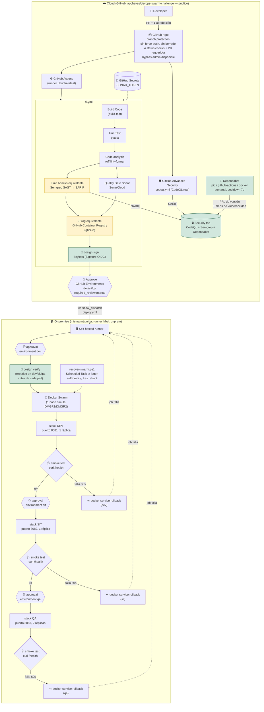

# Arquitectura real vs. reto.png

Este documento muestra la arquitectura **tal como quedó implementada** en este repo, en el mismo formato del diagrama original del reto (`reto.png`), señalando explícitamente dónde se sustituyó una herramienta comercial por un equivalente open-source y por qué.

## Diagrama

> Los bloques en amarillo (`Semgrep`, `GHCR`) son sustituciones documentadas de herramientas comerciales (`Fluid Attacks`, `JFrog Artifactory`) que no fue posible contratar/usar en una cuenta personal — ver el detalle de cada una en `README.md`. Todo lo demás (GitHub Advanced Security, Quality Gate Sonar, el gate de aprobación por ambiente, el runner self-hosted, Docker Swarm) es la herramienta real, no un simulacro.

## Diferencias frente al diagrama original (`reto.png`)

| Elemento | reto.png | Este repo | Motivo |
|---|---|---|---|
| Fluid Attacks | Herramienta comercial | Semgrep (SAST), sube SARIF real a Security | Fluid Attacks exige contrato con mínimo de 10 "autores" facturables, sin tier gratuito |
| JFrog Artifactory | Registry comercial | GitHub Container Registry (ghcr.io) | El trial de JFrog rechaza signup con correo personal (exige dominio corporativo) |
| DMGR1 / DMGR2 | Dos managers Swarm físicos separados | Un solo nodo Swarm en la misma máquina | Simulación de un solo desarrollador; el patrón `docker stack deploy` es idéntico a un swarm multi-nodo real |
| Todo lo demás | — | Igual | GitHub Advanced Security, Quality Gate Sonar, GitHub Secrets, self-hosted runner, gate de aprobación por ambiente y flujo DEV→SIT→QA son la implementación real, no una simulación |

## Capas de seguridad agregadas (no estaban en el diagrama original)

Estas se descubrieron y cerraron durante una auditoría posterior al mapeo inicial, y refuerzan el pipeline sin cambiar su arquitectura:

- Branch protection en `main` (sin force-push, sin borrado, checks de CI requeridos).
- Dependabot: alertas de vulnerabilidad + actualizaciones automáticas de seguridad + PRs de versión (pip, github-actions, docker) con cooldown de 7 días.
- Las 19 referencias `uses: acción@vX` de los workflows pineadas a SHA de commit exacto (mitiga supply-chain attacks tipo repointing de tags, como el caso real de `trivy-action`).
- Contenedor de la app corriendo como usuario no-root.
